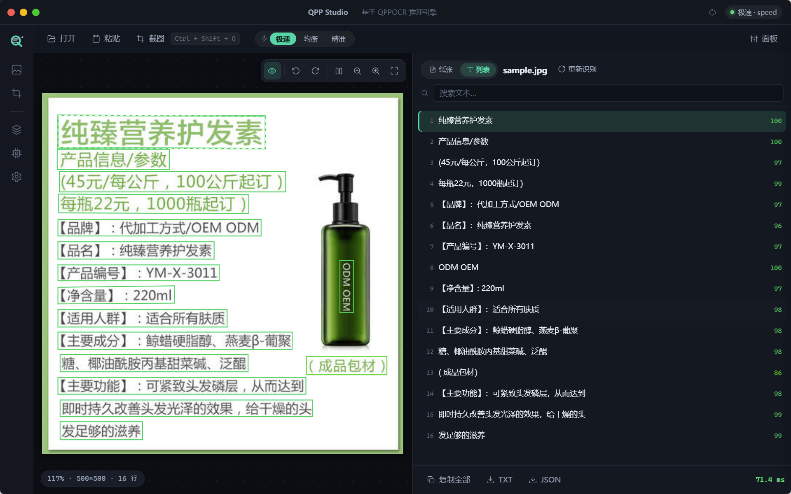
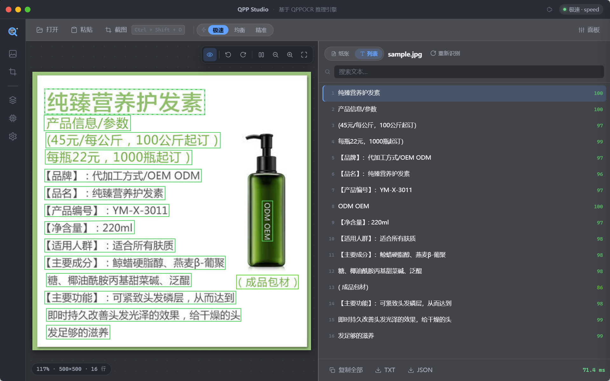
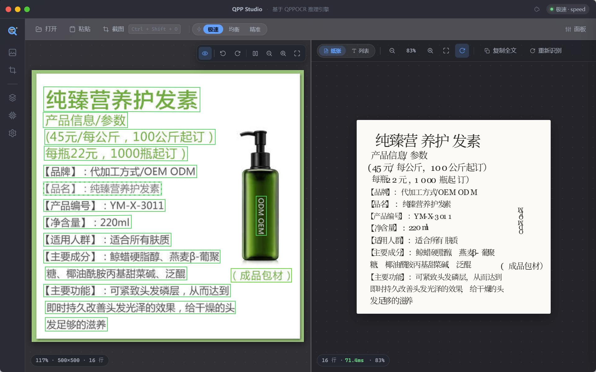
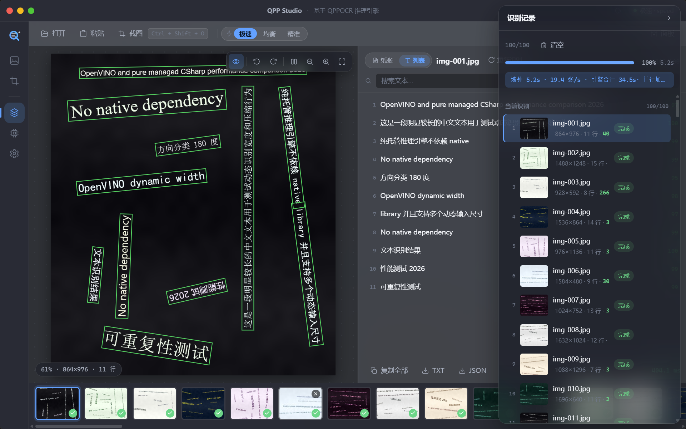
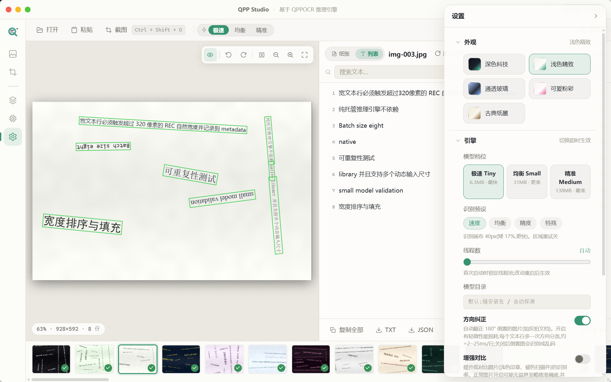
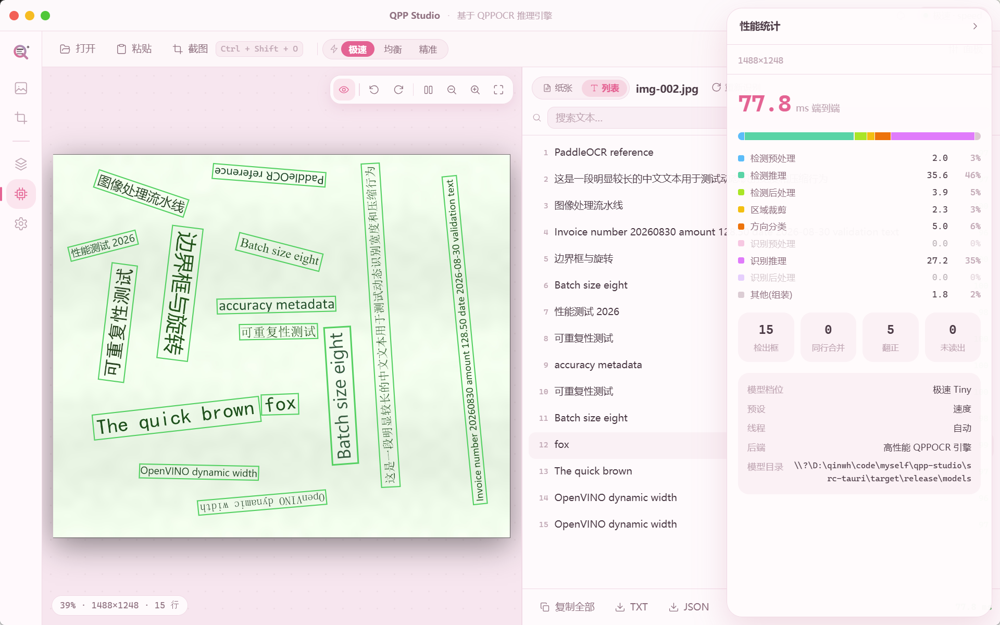

# QPP Studio

基于 [qppocr](https://crates.io/crates/qppocr) 推理引擎的桌面 OCR 应用 —— **本地推理、极速、优雅**。
Tauri v2 + Svelte 5 构建,数据不出机器。

[](LICENSE)
[](https://github.com/qinwenhui/qpp-studio/actions/workflows/ci.yml)

## 特性

- **极速本地识别** — 纯 Rust 引擎(CPU AVX2 / ARM NEON,可选 GPU·Vulkan),tiny 档单张约 60ms,完全离线
- **单图 / 批量并行** — 拖拽、粘贴、文件选择;并行策略按本机硬件自适应(核数/内存/显卡的优化表,免调参),大批量自动多进程分治
- **PDF 整册识别** — 按页并行、随时暂停/继续(只补缺失页);大文档默认按需模式(翻到哪页识别哪页);数字原生 PDF 文本层直提(毫秒级/页,完全跳过 OCR);直提/OCR 可整册或单页互切
- **GPU 加速(实验性)** — Vulkan 1.4+ 驱动;单张场景显著提速,批量是否更快取决于机器,设置内置「本机实测对比」按钮用真实数据说话
- **截图识别** — 全局快捷键(默认 `Ctrl+Shift+O`),微信式"隐藏窗口截图",选区旁弹结果
- **图片画布** — 滚轮缩放(光标锚点)、拖拽平移、旋转、识别框与文字双向联动
- **纸张视图** — 识别结果按原始坐标重排成可选中复制的"电子纸",逐字坐标精确还原版式
- **三档模型** — Tiny(6MB 极速)/ Small(30MB 均衡)/ Medium(138MB 最准),运行时热切换
- **识别预设** — 速度 / 均衡 / 精度 / 监控截图(白字压栏杆等嘈杂背景专用)
- **导出** — TXT / Markdown(版式感知:行高判标题、行距分段落)/ JSON;PDF 支持整册合并导出
- **五套主题** — 深色科技 / 浅色精致 / 通透玻璃 / 可爱粉彩 / 古典纸墨
- **历史记录** — 200 条持久化,随时重开
- **小体积** — 主程序约 14MB;内置 Tiny 模型(7MB)与 PDF 渲染器(pdfium),开箱即用

## 界面截图

| 主界面(深色科技) | 主界面(通透玻璃) |
|:---:|:---:|
|  |  |

| 纸张视图(逐字排版 · 可选中复制) | 批量识别(多进程 · 墙钟统计) |
|:---:|:---:|
|  |  |

<details>
<summary>更多截图(五套主题 / 历史记录)</summary>

| 截图识别(冻结拖框 · 结果随行) | 五套主题 |
|:---:|:---:|
|  |



</details>

## 快速开始

### 安装

从 [Releases](https://github.com/qinwenhui/qpp-studio/releases) 下载安装包(Windows x64)。

### 从源码构建

```bash
# 前置:Node ≥ 20、Rust ≥ 1.85
npm install
# 可选:本地有 qppocr 仓库时可装配模型进安装包(并排放置即可)
# node tools/stage-models.mjs --slim
npm run tauri dev        # 开发调试
npm run tauri build      # 出安装包
```

CI 会自动检查每次提交;打 tag(如 `v0.2.0`)即自动构建并发布 Windows 安装包到 Releases。

### 模型文件

**Tiny 档 + 方向分类模型已内置仓库**(合计约 7MB),构建出的安装包**开箱即用**。

如需更高精度,可自行添加 Small / Medium 档模型:

| 档位 | 文件 | 放置位置(安装目录) | 说明 |
|---|---|---|---|
| **Tiny(内置)** | `det.onnx` + `rec.onnx` + `dict.txt` | `models/tiny/` | 最快,~60ms/张 |
| Small(可选) | `det.onnx` + `rec.onnx` + `dict.txt` | `models/small/` | 更准,~100ms/张 |
| Medium(可选) | `det.onnx` + `rec.onnx` + `dict.txt` | `models/medium/` | 最准,较慢 |
| **方向分类(内置)** | `cls.onnx` | `models/cls.onnx` | 自动翻正 180° 倒置图片 |

模型来自 [PaddleOCR 官方发布](https://github.com/PaddlePaddle/PaddleOCR),
下载对应档位的 det/rec 模型并按上述目录放置即可,应用会自动识别。

从源码构建时,如果本地有 [qppocr 仓库](https://github.com/qinwenhui/qppocr)
并排放置,可运行 `node tools/stage-models.mjs` 装配全部档位的模型到安装包。

## 功能详解

### 识别

- **单图**:拖入窗口 / `Ctrl+V` 粘贴 / 文件选择,识别在后台线程完成,UI 永不卡顿
- **批量**:8 张以上自动多进程分治——每 worker 独立引擎实例、按图片像素权重均衡分配;worker 数由启动时检测的硬件(物理核/内存/GPU)按优化表自动决定,无需调参
- **PDF**:拖入即自动识别——页级并行(渲染与识别都在 worker 进程),可随时暂停/继续(继续只补缺失页);超过 50 页的大文档默认按需模式(翻到哪页识别哪页,也可一键识别全部);有文本层的数字原生 PDF 直接提取文本(毫秒级/页),直提与 OCR 可整册/单页互换
- **GPU**:设置中切换计算设备(Vulkan 1.4+ 驱动,需硬件支持);tiny 档 GPU 输出与 CPU 完全一致;GPU 不一定比 CPU 快,设置内「本机实测对比」给出本机真实数据
- **截图**:`Ctrl+Shift+O`(可自定义)冻结全屏 → 拖框 → 松开即识别,选区旁弹出迷你结果窗;右键截图按钮可选"隐藏本窗口截图"
- **重新识别**:换档位/开增强对比后对当前图原地重跑,结果与耗时即时刷新
- **难图工具箱**:检测放大 2×/3×(小字)、增强对比(浅色印章)、监控预设(白字压栏杆)、区域重试(精度预设)

### 结果

- **列表视图**:阅读顺序、逐行置信度、区域重试标记、搜索、单行/全文复制、TXT/MD/JSON 导出
- **纸张视图**:识别结果按原始坐标逐字排版成一张"电子纸"——字号、字距、竖排忠实还原;拖选复制、右键菜单(复制选中/此行/全文);"原向"开关按原始倾角渲染
- **图片画布**:滚轮缩放(光标锚点)、拖拽平移、旋转后重识别(坐标自动逆变换);悬停文字行 ↔ 高亮识别框双向联动
- **历史**:最近 200 条持久化,点击重开(含完整结果与框)

### 引擎

- 三档模型运行时热切换(重建期间旧引擎继续服务),切档前自动体检文件与字典
- 计算设备(CPU/GPU)热切换,GPU 不可用时明确报错且旧引擎继续服务(不静默降级)
- 识别预设 = 一组实测调优的参数组合(详见设置内提示);EXIF 方向自动转正
- 性能统计面板:九阶段耗时分解、检出/合并/翻正/重试计数、引擎信息(档位/线程/设备)

### 主题

五套完整主题(CSS 设计令牌驱动):深色科技 / 浅色精致 / 通透玻璃(Windows Mica/Acrylic)/ 可爱粉彩 / 古典纸墨。标题栏 🎨 一键循环切换。

## 项目结构

```
src/                  Svelte 5 前端(runes 状态、手绘 SVG 图标、CSS token 五主题)
src-tauri/src/
  engine.rs           引擎管理:设备/档位/预设热切换、切档前体检
  commands.rs         Tauri IPC 命令面
  media.rs            media:// 自定义协议(图片零 base64 过 IPC)
  hw.rs               硬件检测与并行策略优化表(CPU/GPU/内存闸)
  batch.rs            批量:通用 worker 舰队,小批量进程内并发
  worker.rs           自重生 worker(--worker 模式,支持图片/PDF 页任务)
  pdf.rs ingest.rs    PDF:渲染/文本层直提/识别队列(暂停·继续·按需)
  screenshot/         多屏冻结截图 + 选区识别
  image_util.rs       EXIF 方向感知解码
  paper / canvas      见前端:CanvasStage / PaperStage
tools/
  make-icon.mjs       应用图标生成(零依赖)
  stage-models.mjs    打包模型 staging
```

## 快捷键

| 按键 | 功能 |
|---|---|
| `Ctrl+Shift+O` | 截图识别(全局热键,可自定义) |
| `Ctrl+O` | 打开图片/PDF |
| `Ctrl+V` | 粘贴图片 |
| `Ctrl+1..3` | 切换抽屉(记录/统计/设置) |
| `←` / `→` / `PageUp` / `PageDown` | PDF 翻页(输入页码回车跳转) |
| `Esc` / 右键 | 退出截图 |
| 滚轮 | 画布/纸张缩放(PDF 页面滚轮缩放) |

## 性能口径(实测参考)

| 场景 | 耗时 |
|---|---|
| 单张(tiny,热,CPU) | ~60ms |
| 单张(tiny,热,GPU) | ~45ms |
| 单张(small,热) | ~100ms |
| 100 张批量(tiny,多进程) | ~6s |
| 35 页 PDF 整册(tiny,页级并行) | ~4.5s |
| PDF 文本层直提 | 毫秒级/页 |

批量吞吐由进程分治保证:每 worker 独立引擎实例,按图片像素权重均衡分配;
worker 数按本机硬件自动决定(内存闸兜底防 OOM)。

## 交流群

使用问题、玩法交流、引擎与应用开发讨论,欢迎加 QQ 群:

<p align="center">
  
</p>

## 贡献

欢迎 Issue 与 PR。提交前请跑 `npm run check` 与 `cargo check`。

## 许可

本项目基于 [AGPL-3.0](LICENSE) 协议发布 —— 你可以自由使用、修改和分发,
但分发或提供网络服务时必须以相同协议开源,且不得移除署名。
QPP Studio 同时是 qppocr 引擎的官方桌面客户端与集成示例。

- 引擎 [qppocr](https://github.com/qinwenhui/qppocr):MIT OR Apache-2.0
- [Tauri](https://tauri.app) / [Svelte](https://svelte.dev):MIT

## 作者

**qinwh** · [qinwh.cn](https://qinwh.cn) · [GitHub](https://github.com/qinwenhui)
